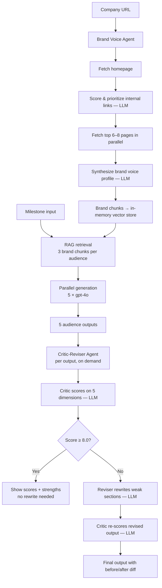

# BrandVoice

> **[Live demo →](https://brandvoice.vercel.app)** &nbsp;|&nbsp; Works without an API key &nbsp;|&nbsp; No account required

---

By Series A, a startup needs to speak credibly to at least five distinct audiences — investors, partners, engineers, senior talent, and journalists — each of whom reads differently, filters for different signals, and will delete the wrong message in under 8 seconds. Most teams write one version of every announcement and hope it travels. It doesn't.

**BrandVoice takes one milestone and produces five audience-specific content pieces in your brand's voice** — in the time it would take to write one draft.

---

## Two AI agents do the work

### 1. Brand Voice Agent
Point BrandVoice at your website URL. The agent autonomously builds a structured voice profile:

1. Fetches the homepage and extracts all internal links
2. Uses an LLM to classify and prioritize links — About, Blog, Press, Product pages ranked HIGH; Login, Contact ranked LOW
3. Fetches up to 8 pages in parallel (no headless browser, plain `fetch`)
4. Synthesizes a brand voice profile: tone descriptors, signature phrases, things the brand avoids, core values, and verbatim sentences for the RAG retrieval pipeline

Progress streams live to a terminal-style log panel. Inaccessible pages are skipped gracefully. Manual paste is always available as fallback.

### 2. Critic-Reviser Agent
After generation, every output runs through a two-agent refinement loop:

- **Critic** scores on 5 dimensions: hook strength, audience fit, brand voice, claim grounding, format compliance — with specific line citations
- **Reviser** rewrites only the weak sections — doesn't touch what's working, doesn't add new claims
- Stops early if first-pass score ≥ 8/10; otherwise runs a second iteration
- UI shows score badges, before/after toggle with highlighted problem lines, and an updated copy button

"Refine All" runs all 5 pipelines in parallel.

---

## Full agent pipeline



---

## The 5 outputs

| Audience | Format | What it optimizes for |
|---|---|---|
| **Investor / VC** | LinkedIn post · 150–200w | Velocity, capital efficiency, what this milestone unlocks next |
| **Strategic Partner** | Cold email + 3 bullets · 150w | Peer-to-peer tone, outcome-focused, soft CTA |
| **Technical Community** | Twitter/X thread · 5 tweets | What was actually hard, open questions, no PR language |
| **Top-of-Funnel Talent** | LinkedIn post · 150–180w | The real problem, what they'll build — "We're hiring" as the last line |
| **Press / Journalist** | Pitch paragraph · 100–130w | Story angle up front, company name in sentence two |

---

## Setup

```bash
git clone https://github.com/priyalshah07/brandvoice.git
cd brandvoice
npm install

cp .env.example .env.local
# Add your OPENAI_API_KEY to .env.local

npm run dev
# Open http://localhost:3000
```

## Environment variables

| Variable | Required | Notes |
|---|---|---|
| `OPENAI_API_KEY` | Yes (for live generation) | From [platform.openai.com/api-keys](https://platform.openai.com/api-keys) |

## Demo mode

**Works without an API key.** Two built-in demo flows:

- **Brand Voice Agent**: Enter `demo.meridian.ai` as the URL — simulates the full agent log with realistic delays, then loads a hardcoded brand profile for fictional Meridian AI
- **Critic-Reviser**: On any demo output card, "Review & Refine (Demo)" loads real critiques written specifically for each Meridian output — not placeholder text

The `/outputs` page shows demo outputs directly when visited without prior generation.

## Tech stack

| Layer | Choice |
|---|---|
| Framework | Next.js 14 (App Router) + TypeScript |
| Styling | Tailwind CSS |
| AI | OpenAI `gpt-4o` via `openai` SDK |
| Vector store | In-memory cosine similarity — no external DB |
| Embeddings | Local 512-dim char bigram + word unigram — no embedding API |
| HTML parsing | `cheerio` |
| Streaming | Next.js `ReadableStream` + SSE |
| Icons | Lucide React |

## Deploy to Vercel

1. Push to GitHub
2. Import the repo at [vercel.com/new](https://vercel.com/new)
3. Add `OPENAI_API_KEY` in Environment Variables
4. Deploy — no other configuration needed
