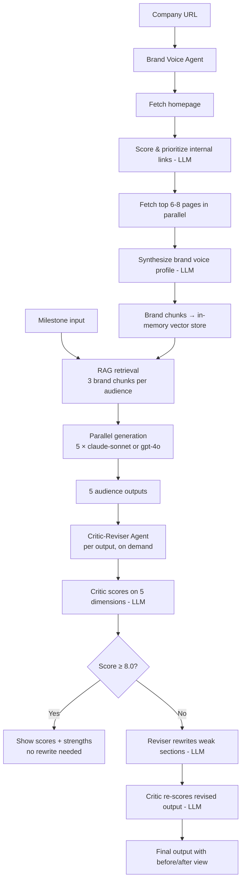

# BrandVoice

Most growth-stage startups write one version of every announcement and hope it lands with everyone. It doesn't. BrandVoice takes a single company milestone and transforms it into five audience-specific content pieces — investor LinkedIn post, partner outreach email, Twitter/X thread for technical communities, talent recruiting copy, and a journalist pitch — all calibrated for the people who actually need to receive them.

BrandVoice now includes two AI agents on top of the generation pipeline: a **Brand Voice Agent** that autonomously builds a voice profile from your website, and a **Critic-Reviser Agent** that scores each output and rewrites weak sections before you publish.

## Why this matters

By Series A, a startup needs to speak credibly to at least five distinct audiences — each of whom reads differently, values different signals, and filters for different credibility markers. The messaging that converts an investor is the exact wrong message for a journalist. The hook that excites a senior engineer is too inside-baseball for a VP of Partnerships. Most teams write one generic version and hope it travels. BrandVoice solves audience fragmentation at the source.

## How it works



## Agentic Features

### Brand Voice Agent

Rather than asking users to paste brand content manually, BrandVoice can autonomously build a brand voice profile from a URL. The agent:

1. Fetches the homepage and extracts all internal links
2. Uses an LLM to classify and prioritize links — HIGH (About, Blog, Press, Product), MEDIUM (Careers, Docs), LOW (Login, Contact, Privacy)
3. Fetches up to 8 pages in parallel using plain `fetch` — no headless browser
4. Synthesizes a structured brand voice profile: tone descriptors, signature phrases, things the brand avoids, content style, core values, and 8–10 verbatim sentences for the RAG pipeline

Progress streams in real time to a terminal-style log panel. If a page is inaccessible (403, timeout, bot wall), the agent skips it and continues. Manual paste remains available as a fallback at any time.

### Critic-Reviser Agent

After generation, each output can be passed through a two-agent refinement loop:

- **Critic**: Scores the output on 5 dimensions (hook strength, audience fit, brand voice, claim grounding, format compliance), citing specific lines — not generic feedback
- **Reviser**: Rewrites only the weak sections identified — doesn't touch what's working, doesn't add new claims, doesn't change the format
- Runs up to 2 iterations; stops early if first-pass score is ≥ 8/10
- UI shows dimension score badges, before/after toggle with yellow-highlighted problem lines, collapsible issues log, and an updated copy button

"Refine All" runs all 5 pipelines in parallel with a per-card progress indicator.

## The 5 audiences

| Audience | Format | Purpose |
|---|---|---|
| **Investor / VC** | LinkedIn post (150–200w) | Signals velocity and capital efficiency to fund readers |
| **Strategic Partner** | Cold email opening + 3 bullets (150w) | Opens a conversation without sounding like a pitch |
| **Technical Community** | Twitter/X thread, 5 tweets | Earns credibility with engineers and domain experts |
| **Top-of-Funnel Talent** | LinkedIn post (150–180w) | Attracts senior hires evaluating their next move |
| **Press / Journalist** | Pitch paragraph (100–130w) | Gives journalists a story angle, not a press release |

## Setup

```bash
git clone <repo>
cd BrandVoice
npm install

cp .env.example .env.local
# Add your OPENAI_API_KEY to .env.local

npm run dev
# Open http://localhost:3000
```

## Environment variables

| Variable | Required | Description |
|---|---|---|
| `OPENAI_API_KEY` | Yes (for live generation) | From [platform.openai.com/api-keys](https://platform.openai.com/api-keys) |

## Demo mode

**Works without an API key.** Two demo flows are available:

- **Brand Voice Agent demo**: Enter `demo.meridian.ai` as the URL. The agent simulates its log output with realistic delays, then loads a hardcoded brand profile for the fictional Meridian company.
- **Critic-Reviser demo**: On the demo outputs page, each "Review & Refine (Demo)" button loads a hardcoded critique result after a short delay. The critiques are real and specific — written for each Meridian demo output, not placeholder text.

The `/outputs` page also displays demo outputs directly when navigated to without prior generation.

## Tech stack

| Layer | Choice |
|---|---|
| Framework | Next.js 14 (App Router) + TypeScript |
| Styling | Tailwind CSS |
| AI — generation | OpenAI `gpt-4o` via `openai` SDK |
| AI — link scoring, synthesis, critique | OpenAI `gpt-4o` |
| Vector store | In-memory cosine similarity (no external DB) |
| HTML parsing | `cheerio` |
| Icons | Lucide React |
| Streaming | Next.js `ReadableStream` + SSE |

## Deployment

Deploy to Vercel in one click. Add `OPENAI_API_KEY` in your Vercel project settings. The `vercel.json` is pre-configured.
